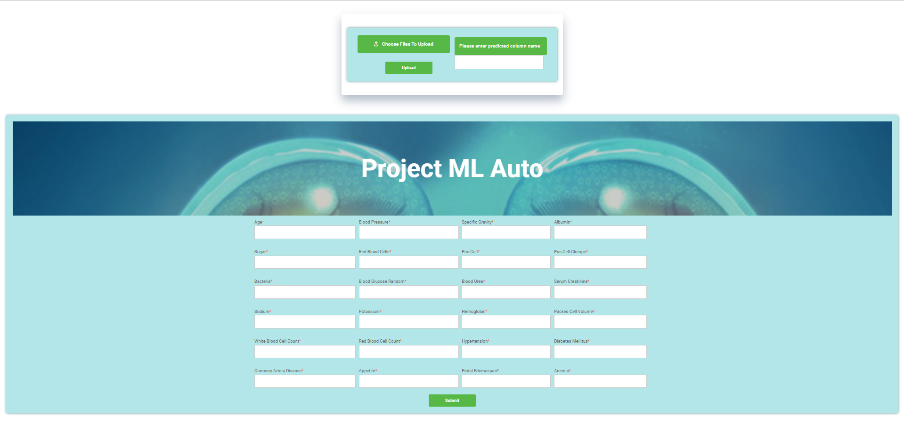

# Project-ML-Auto

This is a research-based project where we are trying to automate the whole data pre-processing from the backend and give the user a UI to upload the csv data from the front and input the data from the frontend to predict something according to the uploaded data.

The system will be able to find the best algorithm based on the data provided by the user.

For now, we are only using one algorithm, the logistic algorithm.

Please see the visual site of the web interface.

### Input site

### Output result

